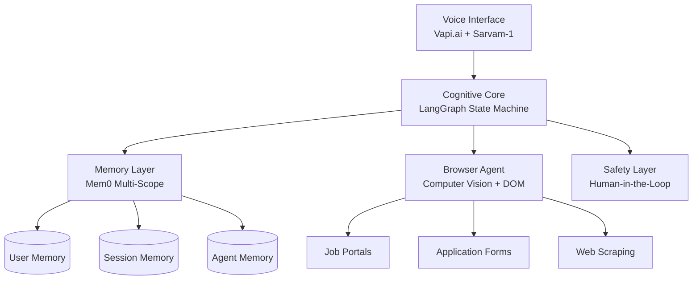

# Design Document: Sovereign Career Architect

## Overview

The Sovereign Career Architect is an autonomous AI agent built on a cognitive architecture that can think, plan, act, and improve. Unlike traditional chatbots that provide passive responses, this system actively navigates the user's career lifecycle through autonomous web interactions, persistent memory, and voice-enabled conversations in Indic languages.

The system transforms the job hunting experience from manual, scattered platform navigation to an intelligent, automated workflow that reduces cognitive load while maintaining user control over high-stakes decisions.

## Architecture

The system follows a modular cognitive architecture with five core components:



### Core Architectural Principles

1. **Stateful Execution**: Uses LangGraph's cyclic state machine instead of linear chains for robust error handling and self-correction
2. **Persistent Context**: Maintains long-term memory across sessions using Mem0's hierarchical scoping
3. **Autonomous Action**: Breaks out of chat interfaces to perform real web interactions via Browser-use
4. **Cultural Sovereignty**: Processes Indic languages natively using Sarvam-1 for authentic user experience
5. **Accountable Agency**: Implements human-in-the-loop controls for high-stakes actions

## Components and Interfaces

### 1. Cognitive Core (LangGraph State Machine)

The cognitive core implements a directed graph where nodes represent computational steps and edges represent control flow. This enables reflective loops and self-correction.

**AgentState Schema:**
```python
class AgentState(TypedDict):
    messages: List[BaseMessage]          # Conversation history
    user_profile: Dict[str, Any]         # Retrieved from Mem0
    current_plan: List[str]              # Generated task sequence
    tool_outputs: List[Dict]             # Raw execution results
    critique: str                        # Self-assessment feedback
    retry_count: int                     # Loop prevention counter
```

**Node Architecture:**
- **Profiler Node**: Retrieves user context from Mem0 and enriches incoming requests
- **Planner Node**: Uses high-reasoning model (Llama-3-70B) to generate step-by-step plans
- **Executor Node**: Interfaces with external tools (Browser-use, APIs) to perform actions
- **Reviewer Node**: Validates outputs against user profile and provides feedback for self-correction
- **Archivist Node**: Extracts salient facts and updates long-term memory

### 2. Memory Layer (Mem0)

Implements hierarchical memory scopes to maintain context across different time horizons:

**Memory Scopes:**
- **User Memory**: Static facts (education, skills, preferences) - persists globally
- **Session Memory**: Immediate context (current job search, active documents) - temporary
- **Agent Memory**: Learned interaction patterns (user communication style) - meta-memory

**Key Operations:**
- `mem0.search(query, user_id)`: Semantic retrieval of relevant memories
- `mem0.add(memory, user_id, metadata)`: Store new facts with relationship mapping
- Dynamic context injection at session start via Profiler Node

### 3. Browser Agent (Computer Vision + DOM)

Enables autonomous web interaction through multimodal approach combining visual perception and DOM analysis:

**Technical Implementation:**
- Uses Browser-use library with headless Chromium via Chrome DevTools Protocol
- Injects highlighting script to mark interactive elements with numeric IDs
- Captures screenshots + simplified DOM for Vision-Language Model analysis
- GPT-4o processes visual + text input to identify interaction targets

**Capabilities:**
- Navigate job portals (LinkedIn, Y Combinator, company career pages)
- Fill application forms using stored user data
- Handle file uploads (resume, portfolio documents)
- Implement stealth mode to avoid bot detection
- Visual-based recovery from DOM structure changes

### 4. Voice Interface (Vapi.ai + Sarvam-1)

Provides real-time voice interaction with cultural and linguistic authenticity:

**Vapi.ai Integration:**
- Handles Voice Activity Detection, Speech-to-Text, Text-to-Speech pipeline
- Sub-500ms latency for natural conversation flow
- Server-side tool calling to trigger LangGraph agent functions
- Streaming responses to reduce Time to First Byte

**Sarvam-1 Integration:**
- Processes 10 Indic languages with 2-4x better tokenization efficiency
- Token fertility rate of 1.4-2.1 vs 4-5 for standard models
- Cultural context preservation in generated responses
- Deployed via Hugging Face Inference Endpoints

### 5. Safety Layer (Human-in-the-Loop)

Implements accountable agency through strategic intervention points:

**Intervention Triggers:**
- High-stakes actions (job applications, profile updates)
- Error recovery scenarios (CAPTCHA, verification required)
- User-defined approval workflows

**Implementation:**
- LangGraph `interrupt_before` functionality for pause-and-approve workflows
- Clear action summaries presented to user before execution
- Audit logging of all automated actions
- Graceful handoff mechanisms for complex scenarios

## Data Models

### User Profile Model
```python
class UserProfile:
    personal_info: PersonalInfo
    skills: List[Skill]
    experience: List[Experience]
    preferences: JobPreferences
    documents: DocumentStore
    
class JobPreferences:
    roles: List[str]
    locations: List[str]
    salary_range: SalaryRange
    company_types: List[str]
    work_arrangements: List[str]
```

### Memory Model
```python
class Memory:
    id: str
    content: str
    metadata: Dict[str, Any]
    scope: MemoryScope  # USER, SESSION, AGENT
    timestamp: datetime
    relationships: List[str]  # Graph connections
```

### Agent State Model
```python
class AgentState:
    session_id: str
    user_id: str
    current_node: str
    execution_history: List[NodeExecution]
    active_tools: List[Tool]
    interrupt_state: Optional[InterruptState]
```

## Error Handling

### Browser Automation Resilience
- **Vision-based Recovery**: VLM can identify UI elements even after DOM changes
- **Retry Budget**: Maximum 3 attempts per action before escalation
- **Stealth Configuration**: Modified headers and human-like delays to avoid detection
- **Graceful Degradation**: Fallback to manual user guidance for complex scenarios

### Memory Consistency
- **Conflict Resolution**: Timestamp-based precedence for conflicting memories
- **Semantic Deduplication**: Vector similarity checks to prevent redundant storage
- **Scope Isolation**: Clear boundaries between User, Session, and Agent memories

### Voice Interaction Reliability
- **Optimistic Acknowledgment**: Immediate filler responses while processing
- **Language Detection**: Automatic routing between Sarvam-1 and standard models
- **Fallback Mechanisms**: Text interface available if voice processing fails

## Testing Strategy

The system requires both unit testing for specific components and property-based testing for universal behaviors across the cognitive architecture.

### Unit Testing Approach
- **Component Isolation**: Test individual nodes (Planner, Executor, Reviewer) with mock states
- **Integration Points**: Verify Mem0 integration, Vapi.ai webhook handling, Browser-use tool execution
- **Edge Cases**: Empty memory states, network failures, malformed web pages
- **Error Conditions**: Invalid user inputs, API timeouts, authentication failures

### Property-Based Testing Configuration
- **Framework**: Use Hypothesis (Python) for property-based test generation
- **Test Iterations**: Minimum 100 iterations per property to ensure statistical confidence
- **Tag Format**: `# Feature: sovereign-career-architect, Property {N}: {description}`
- **Requirements Traceability**: Each property test references specific acceptance criteria

Property-based testing will validate universal behaviors that should hold across all valid inputs, ensuring the system maintains correctness as it scales to handle diverse user scenarios and web environments.

## Correctness Properties

*A property is a characteristic or behavior that should hold true across all valid executions of a system—essentially, a formal statement about what the system should do. Properties serve as the bridge between human-readable specifications and machine-verifiable correctness guarantees.*

Based on the prework analysis, the following properties have been identified as testable universal behaviors that must hold across all valid system executions:

### Property 1: Autonomous Navigation Consistency
*For any* job portal website structure, when the agent is requested to navigate for job search, the agent should successfully identify and interact with job-related elements using computer vision.
**Validates: Requirements 1.1**

### Property 2: Form Filling Completeness
*For any* job application form and user profile data, when the agent encounters the form, all available user data fields should be correctly populated in the corresponding form fields.
**Validates: Requirements 1.2**

### Property 3: Job Matching Accuracy
*For any* job posting and user profile, when the agent extracts job requirements, the matching score should accurately reflect the alignment between job requirements and user qualifications.
**Validates: Requirements 1.3**

### Property 4: Stealth Mode Activation
*For any* anti-bot detection scenario, when the agent encounters bot prevention measures, stealth mode configurations should be automatically activated to maintain access.
**Validates: Requirements 1.4**

### Property 5: Action Summary Generation
*For any* completed job search task sequence, the agent should generate a comprehensive summary containing all actions performed and their outcomes.
**Validates: Requirements 1.5**

### Property 6: Plan Structure Consistency
*For any* user request requiring multi-step execution, when the agent generates a plan, the output should be a well-structured sequence of actionable tasks with clear dependencies.
**Validates: Requirements 2.2**

### Property 7: Output Validation Reliability
*For any* agent execution output, the system should validate the output against both the user profile and current plan, rejecting outputs that don't meet the criteria.
**Validates: Requirements 2.3**

### Property 8: Self-Correction Loop Activation
*For any* output deemed suboptimal by the reviewer, the agent should automatically loop back to the planning phase with specific feedback for improvement.
**Validates: Requirements 2.4**

### Property 9: Error Recovery Mechanism
*For any* error encountered during execution, the agent should implement appropriate retry logic with exponential backoff and eventual escalation.
**Validates: Requirements 2.5**

### Property 10: Memory Persistence Across Sessions
*For any* user profile data stored in one session, the data should be retrievable and consistent in all subsequent sessions for the same user.
**Validates: Requirements 3.1**

### Property 11: Context Retrieval Accuracy
*For any* user returning after a time gap, the memory layer should retrieve contextually relevant information from previous interactions based on semantic similarity.
**Validates: Requirements 3.2**

### Property 12: Memory Update Consistency
*For any* new information learned about a user during interaction, the memory layer should successfully store and make the information available for future retrieval.
**Validates: Requirements 3.4**

### Property 13: Semantic Search Relevance
*For any* memory query, the semantic search should return results ranked by relevance with the most contextually appropriate memories appearing first.
**Validates: Requirements 3.5**

### Property 14: Language Model Routing
*For any* input detected as an Indic language, the voice orchestrator should route the processing to the Sarvam-1 model rather than standard language models.
**Validates: Requirements 4.2**

### Property 15: Voice Command Mapping
*For any* voice command received by the orchestrator, the system should correctly map the command to the appropriate agent function and execute it.
**Validates: Requirements 4.4**

### Property 16: Interview Language Adaptation
*For any* interview practice request, the agent should conduct the mock interview in the user's specified preferred language with appropriate technical terminology.
**Validates: Requirements 5.1**

### Property 17: Question Relevance Generation
*For any* user's target role, the agent should generate technical interview questions that are specifically relevant to the skills and responsibilities of that role.
**Validates: Requirements 5.2**

### Property 18: Interview Feedback Completeness
*For any* completed interview session, the agent should provide feedback covering both behavioral aspects and content accuracy of the user's responses.
**Validates: Requirements 5.4**

### Property 19: Knowledge Gap Identification
*For any* interview session where knowledge gaps are identified, the agent should provide specific, actionable suggestions for improvement in the identified areas.
**Validates: Requirements 5.5**

### Property 20: High-Stakes Action Approval
*For any* action classified as high-stakes, the agent should pause execution and request explicit user approval before proceeding.
**Validates: Requirements 6.1**

### Property 21: Action Summary Clarity
*For any* action requiring approval, the agent should present a clear, comprehensive summary that allows the user to make an informed decision.
**Validates: Requirements 6.2**

### Property 22: Approval Workflow Execution
*For any* user approval received, the agent should proceed with the exact action described in the approval request without deviation.
**Validates: Requirements 6.3**

### Property 23: Denial Handling Protocol
*For any* user denial of approval, the agent should immediately abort the proposed action and return to the planning phase for alternative approaches.
**Validates: Requirements 6.4**

### Property 24: Audit Trail Completeness
*For any* action performed by the agent on behalf of the user, a complete audit log entry should be created with timestamp, action details, and outcome.
**Validates: Requirements 6.5**

### Property 25: Visual Element Recognition
*For any* web page with interactive elements, the browser agent should successfully identify clickable, fillable, and navigable elements using computer vision analysis.
**Validates: Requirements 7.1**

### Property 26: Dynamic Adaptation Capability
*For any* web page that undergoes DOM structure changes, the browser agent should adapt its interaction strategy using visual recognition rather than failing.
**Validates: Requirements 7.2**

### Property 27: File Upload Handling
*For any* file upload requirement encountered, the browser agent should successfully locate and upload the appropriate user documents from the stored file system.
**Validates: Requirements 7.3**

### Property 28: Human Escalation Trigger
*For any* complex verification scenario (CAPTCHA, multi-factor authentication), the browser agent should appropriately escalate to request human assistance.
**Validates: Requirements 7.4**

### Property 29: Rate Limiting Compliance
*For any* sequence of web interactions, the browser agent should implement appropriate delays between actions to avoid triggering anti-bot detection systems.
**Validates: Requirements 7.5**

### Property 30: Indic Language Processing Efficiency
*For any* input in the 10 supported Indic languages, the Sarvam-1 model should process the text with tokenization efficiency within the specified 1.4-2.1 fertility rate range.
**Validates: Requirements 8.1, 8.3**

### Property 31: Cultural Preference Adaptation
*For any* user with stored cultural communication preferences, the agent should adapt its response style and tone to match those preferences consistently.
**Validates: Requirements 8.4**

### Property 32: Code-Switching Support
*For any* conversation containing mixed English and Indic language content, the agent should seamlessly process and respond appropriately to both language components.
**Validates: Requirements 8.5**